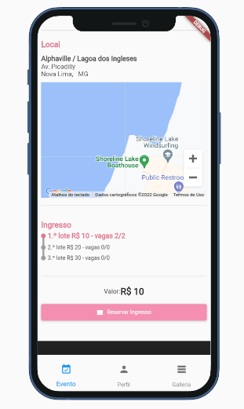

# Grafu Frontend

Stripe Webhook: [https://github.com/Rosnaldo/grafu_stripe_webhook/blob/main/README.md](https://github.com/Rosnaldo/grafu_stripe_webhook/blob/main/README.md) <br>
Api repository: [https://github.com/Rosnaldo/grafu_back/blob/main/README.md](https://github.com/Rosnaldo/grafu_back/blob/main/README.md)

## Screenshots
<p align="center">
  
  
  
  
  
  
  
  
</p>

<br>

## Specifications 
platforms: Web | Android | Ios <br>
framework: Flutter <br>
other tools: Firebase(Authentication and image storage) and Stripe (Payment) <br>

<br>

## Features 
• login and register <br>
• login social google <br>
• form errors feedback <br>
• backend errors feedback <br>
• session memorization control (user not to log out alone) <br>
• email verification (activate user by email) <br>
• avatar photo upload <br>
• avatar image crop <br>
• google maps street location <br>
• images with cache <br>
• payment integration with stripe <br>

<br>

## Architeture decisitons
• State management ValueNotifier and Mobx <br>
• Modular Architeture <br>
• Page widgets are divided in two layers (Container and Business) <br>
• Clean Architeture concepts <br>

<br>

ValueNotifier was used for small scoped functions and triple statement when fetching data and loading the page. <br>
Mobx is been used for global stores. <br>
Business functionalities are divided into modules with an eye on the future in case you need to split into micro-frontends. <br>
Page widgets has two layers so it can be tested by two diferent methods.<br>
The business layer carry on all the business rules and services so it is tested by unit tests. <br>
The container layer is responsible for widget view properties so it is tested by storybook. <br>
Since container does not depend on business layer but on an abstraction, the business layer can be mocked. <br>
The isn't a single page that is not in the storybook catalog. <br>
Entities, services and repositories are divided into separed layers respecting Clean Architeture principles. <br>
Also all services are been injected. <br>

<br>

## Flutter build runner

```
flutter pub run build_runner clean
flutter pub run build_runner watch
```

## deploy

```
flutter build web
firebase deploy
```
